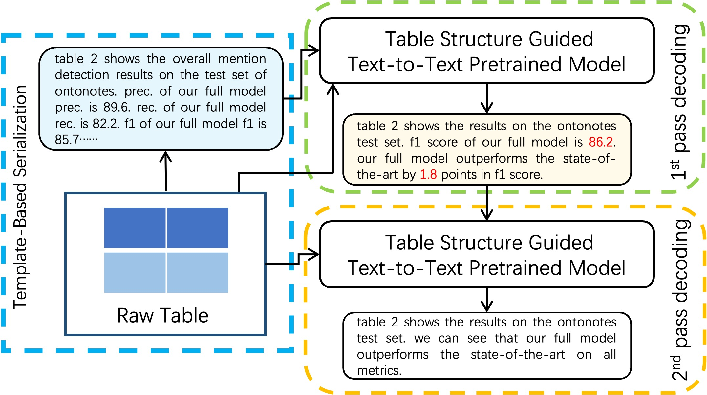

## Introduction

This source code correspond to our paper "Towards Table-to-Text Generation with Pretrained Language Model: A Table Structure Understanding and Text Deliberating Approach" (EMNLP 2022).

If you find this code or any of the ideas in this paper useful, please consider citing:

```bibtex
@inproceedings{chen2022towards,
title={Towards Table-to-Text Generation with Pretrained Language Model: A Table Structure Understanding and Text Deliberating Approach},
author={Miao Chen and Xinjiang Lu and Tong Xu and Yanyan Li and Jingbo Zhou and Dejing Dou and Hui Xiong},
booktitle={The 2022 Conference on Empirical Methods in Natural Language Processing (EMNLP' 22)},
year={2022}
}
```

We propose a table-to-text approach, named TASD, with the help of 
pretrained language model, table structure understanding, and text deliberation. 

The framework overview is as follows:



For more details about our approach, please refer to [this preprint version](https://arxiv.org/pdf/2301.02071.pdf).
We implement TASD with three deep learning framework: i.e., 
PyTorch, Tensorflow, and [PaddlePaddle](https://www.paddlepaddle.org.cn/en). 


## Installation

Run the following command to install the required dependencies (for a specific DL framework).

```
pip install -r {$path_to_certain_framework_folder}/requirements.txt
```

## Data

Unzip the data in the folder

```
cd data
unzip numericNLG.zip
unzip Totto.zip
```

## Loading Pretrained Models
To download the pretrained models and mofify the config.json in order to fit the TASD.
```
cd models
python paddle.py
python pytorch.py
```

## Usage


